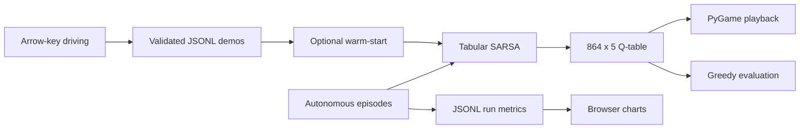
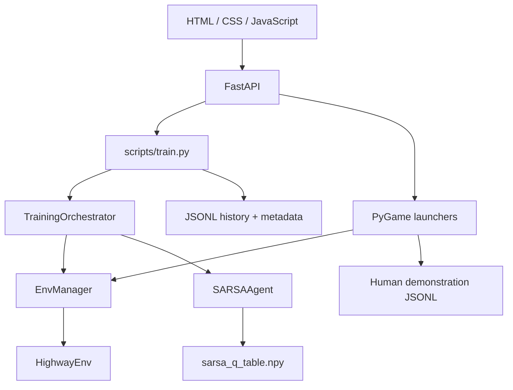
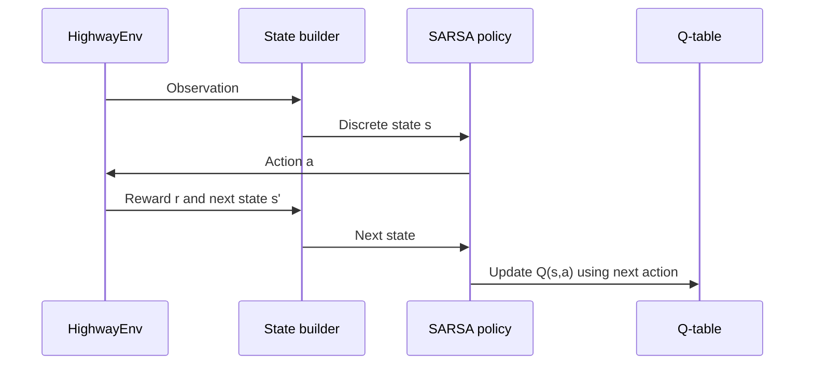
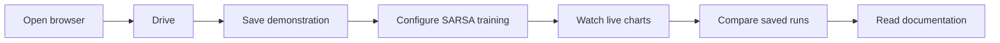

# Arena Self-Driving

## A transparent SARSA workbench for highway-driving experiments

Arena Self-Driving is a local educational reinforcement-learning project built
around HighwayEnv. You can drive the environment yourself, save demonstrations,
warm-start a tabular SARSA policy, train it autonomously, inspect the metrics,
and watch the saved policy play.

> **Important:** this is an educational simulation, not a real-world driving
> system.

<p align="center">
  <strong>Human demonstrations</strong>
  &nbsp;→&nbsp;
  <strong>SARSA learning</strong>
  &nbsp;→&nbsp;
  <strong>Native playback</strong>
</p>

## What the project does



The project has one supported model label:

```text
S = tabular SARSA
```

There is no neural model in the current product. The earlier DQN direction is
documented in the [project timeline](docs/timeline.md), but the supported
implementation is deliberately smaller, inspectable, and reproducible.

## Visual preview

The repository currently does not include committed screenshot assets. The
actual visual surfaces are:

| Surface | What you see |
|---|---|
| Browser workbench | Training form, live charts, saved runs, documentation |
| Human PyGame window | Orange ego vehicle, keyboard controls, traffic, HUD |
| Agent PyGame window | Saved SARSA policy playing with action and reward details |

Start the workbench and open the live preview at
[`http://127.0.0.1:8000`](http://127.0.0.1:8000):

```powershell
python -m backend.main
```

## Technology stack

| Technology | Role |
|---|---|
| Python 3.13 | Runtime and training scripts |
| HighwayEnv | Highway-driving simulation and traffic |
| Gymnasium | Environment and action/step interface |
| NumPy | Q-table storage and numerical state operations |
| SARSA | On-policy temporal-difference learning algorithm |
| FastAPI | Local HTTP/WebSocket control API |
| Uvicorn | ASGI server |
| PyGame | Native human driving and agent playback windows |
| PyYAML | Environment and state-bin configuration |
| HTML/CSS/JavaScript | No-build browser dashboard |
| Canvas API | Lightweight live metric charts |
| JSONL | Demonstrations and per-episode histories |
| pytest | Automated regression tests |

The browser frontend intentionally has no Node.js build step, bundler, React
runtime, or chart dependency. FastAPI serves the plain files in `frontend/`.

## Architecture at a glance



| Layer | Responsibility |
|---|---|
| `frontend/` | Calm responsive dashboard, forms, charts, docs |
| `backend/` | Request validation, worker ownership, WebSockets |
| `src/envs/` | Actions, HighwayEnv creation, state conversion |
| `src/simulation/` | Shared reset/step simulation facade |
| `src/agents/` | SARSA policy, epsilon-greedy actions, Q updates |
| `src/training/` | Training, evaluation, warm-start orchestration |
| `src/data/` | JSONL schemas, recorder, validator, loader |
| `scripts/` | Human, agent, training, evaluation, publishing entry points |
| `docs/` | Architecture, algorithm, security, commands, timeline |

## Quick start

Run these commands from the repository root:

```powershell
python -m venv venv
venv\Scripts\activate
pip install -r requirements.txt
python -m backend.main
```

Then open `http://127.0.0.1:8000`.

If port `8000` is already occupied, reuse the existing server or stop only the
specific process using that port before starting another one.

## The learning loop



The observation is discretised into:

```text
4 lanes
× 3 speed categories
× 3 front-gap categories
× 3 front-speed-difference categories
× 2 left-lane safety values
× 2 right-lane safety values
× 2 rear-gap categories
= 864 states
```

The five actions are:

```text
0  lane left
1  idle
2  lane right
3  faster
4  slower
```

The saved model is therefore a small table:

```text
artifacts/checkpoints/sarsa_q_table.npy
shape: (864, 5)
```

SARSA uses the on-policy update:

```text
Q(s,a) ← Q(s,a) + α [r + γ Q(s',a') − Q(s,a)]
```

For terminal transitions, the next-state value is zero. Read the complete
[SARSA algorithm notes](docs/algorithm_notes.md) for state bins, tie-breaking,
epsilon decay, rewards, warm-start behavior, and checkpoint semantics.

## Human demonstrations

Demonstrations are optional. Save them before asking training to use them:

```powershell
python scripts/play_human.py
```

In the native window:

1. Use **Left/Right** for lane changes.
2. Use **Up/Down** for speed actions.
3. Finish the episode.
4. Press **S** to save, **X** to discard, or **Esc** to close.

Saved demonstrations are written to:

```text
data/human_demonstrations/*.jsonl
```

Warm-start a training run with them:

```powershell
python scripts/train.py --episodes 100 --resume --warm-start --seed 2000
```

Warm-start applies SARSA updates to validated human transitions before
autonomous learning. It does not permanently copy a human policy and does not
delete or modify the demonstrations.

## Train, resume, evaluate, and play

### Start a fresh runtime table

```powershell
python scripts/train.py --episodes 50 --seed 1000
```

Without `--resume`, training starts with a zero-initialised table and eventually
replaces the runtime checkpoint. It does **not** delete demonstrations, old run
history, published files, source code, or configuration.

### Continue the saved model

```powershell
python scripts/train.py --episodes 100 --resume --seed 2000
```

`--seed` controls repeatability. It does not create a new model or clear data.

### Evaluate without learning

```powershell
python scripts/evaluate_model.py --episodes 10 --steps 300 --seed 1000
```

Evaluation uses greedy actions, does not update the Q-table, and appends
average reward, survival steps, and collision-free rate to
[`accuracy.md`](accuracy.md).

### Watch the policy

```powershell
python scripts/play_agent.py
```

Interactive playback includes target speed, duration, road mode, pause, HUD,
and native traffic visualization. Use `--train --save` only when you
intentionally want interactive playback to update the checkpoint.

## Browser workflow



The browser can:

- Launch local human driving.
- Launch local agent playback.
- Start and stop one training job.
- Stream reward, steps, epsilon, and TD-error metrics.
- Load previous run histories.
- Show demonstration totals.
- Display the project documentation.

The browser does not embed the PyGame window. PyGame owns native rendering and
keyboard input; the browser owns orchestration and evidence review.

## Storage and model safety

```text
<storage-root>/
|-- data/human_demonstrations/*.jsonl
|-- artifacts/checkpoints/sarsa_q_table.npy
|-- artifacts/runs/<browser-run-id>/
|-- published/checkpoints/
`-- accuracy.md
```

By default, the storage root is the repository. Use a separate root for an
independent experiment:

```powershell
$env:ARENA_STORAGE_DIR = "D:\arena-experiment-2"
python scripts/train.py --episodes 100 --seed 2000
Remove-Item Env:ARENA_STORAGE_DIR
```

Back up the runtime table before intentionally starting a fresh run:

```powershell
Copy-Item artifacts\checkpoints\sarsa_q_table.npy `
  artifacts\checkpoints\sarsa_q_table.backup.npy
```

For the complete storage, checkpoint, and database-layer explanation, see
[Architecture](docs/architecture.md) and [Commands](docs/commands.md).

## Publishing a model

Training artifacts are not automatically committed. Review evaluation first:

```powershell
python scripts/evaluate_model.py --episodes 10 --steps 300 --seed 1000
python scripts/publish_model.py
git add published accuracy.md
git commit -m "Publish improved SARSA baseline"
git push
```

`publish_model.py` copies the runtime checkpoint and newest history into
`published/`. Git commit and push remain explicit.

## Testing

```powershell
python -m pytest
python -m compileall -q backend scripts src tests
git diff --check
```

These commands validate the code and do not train or replace the model.

## Documentation map

| Document | Best for |
|---|---|
| [Project documentation](docs/project_documentation.md) | Complete end-to-end guide |
| [Architecture](docs/architecture.md) | Components, data layer, and diagrams |
| [SARSA algorithm](docs/algorithm_notes.md) | State representation and update rule |
| [Commands](docs/commands.md) | Every workflow and command |
| [Backend notes](docs/backend_notes.md) | FastAPI, jobs, WebSockets, hosted mode |
| [Security notes](docs/security_notes.md) | Validation, risks, and test coverage |
| [UI design system](docs/ui_design_system.md) | Typography, colors, interactions |
| [Timeline](docs/timeline.md) | DQN history, SARSA migration, project progress |
| [Performance history](accuracy.md) | Repeatable evaluation evidence |

## Project status

The project is complete as an educational SARSA workbench:

- Human demonstrations
- Warm-start learning
- Autonomous tabular SARSA
- Native human and agent playback
- Browser training control
- Live analytics
- Checkpoint and run history persistence
- Evaluation and publishing workflow
- Security, architecture, UI, algorithm, command, and timeline documentation

Made with heart by Priyanshu ❤️
