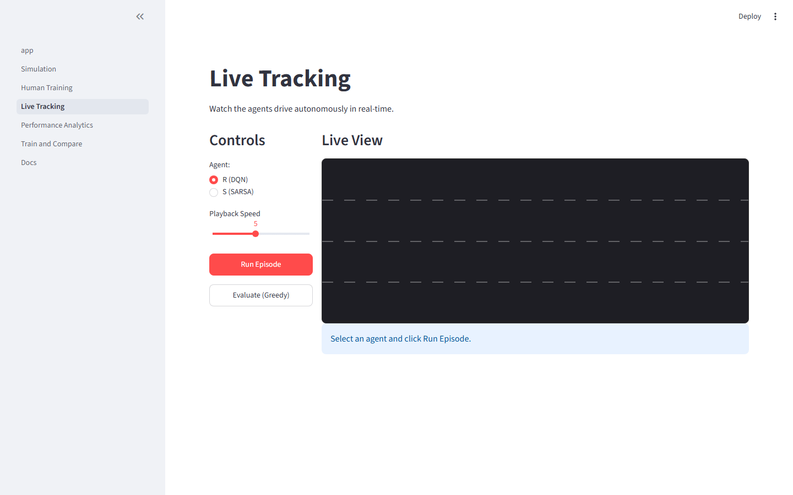
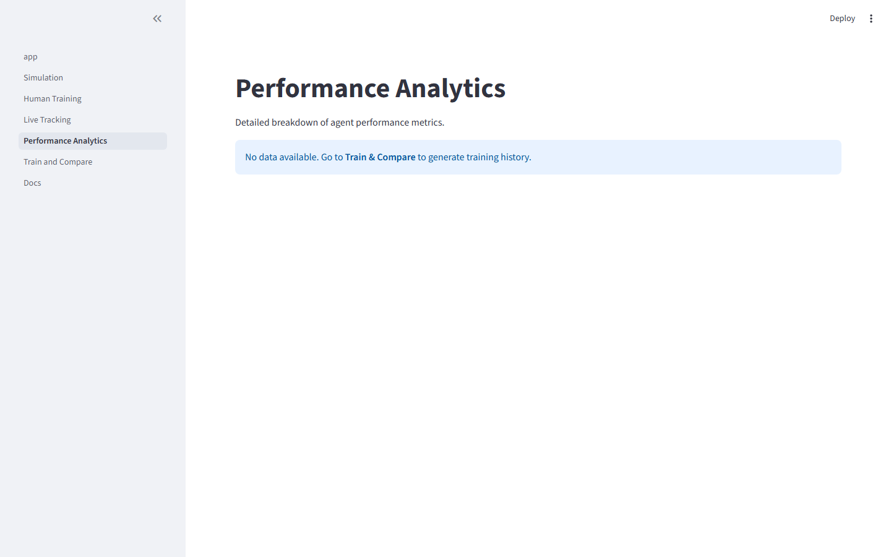

# Self-Driving Car Simulation MVP

> **A comparative study of DQN vs SARSA for autonomous highway driving,
> trained on shared human demonstrations.**

[]()
[]()
[]()

---

## 🚗 What is this?



A simulation-based comparison of two reinforcement learning algorithms
applied to self-driving on a highway:

- **Vehicle R** — trained with **DQN** (Deep Q-Network), an off-policy
  neural-network Q-learner using experience replay.
- **Vehicle S** — trained with **SARSA** (State-Action-Reward-State-Action),
  an on-policy tabular learner.



Both agents learn from **identical human demonstrations** collected in
[HighwayEnv](https://github.com/Farama-Foundation/HighwayEnv).
The algorithm is the only controlled variable.

---

## 📁 Project structure

```
arena-self-driving/
├── app.py                    # Streamlit entry point
├── pages/                    # Streamlit multi-page UI
│   ├── 1_Simulation.py
│   ├── 2_Human_Training.py
│   ├── 3_Live_Tracking.py
│   ├── 4_Performance_Analytics.py
│   ├── 5_Train_and_Compare.py
│   └── 6_Docs.py
├── src/
│   ├── envs/                 # HighwayEnv factory, state builder, actions
│   ├── agents/               # DQN (R) and SARSA (S) implementations
│   ├── human/                # Keyboard control & episode recording
│   ├── data/                 # Demo recording, validation, loading
│   ├── training/             # Training orchestration
│   ├── evaluation/           # Fixed-seed evaluation & metrics
│   └── simulation/           # Façade for UI pages
├── configs/                  # YAML configuration files
├── assets/                   # Generated icons, sprites, textures
├── data/
│   ├── human_demonstrations/ # JSONL files from human driving
│   └── autonomous_logs/      # JSONL files from agent evaluation
├── artifacts/
│   ├── checkpoints/          # Saved model weights
│   └── reports/              # Evaluation reports
├── tests/                    # pytest test suite
├── scripts/                  # Utility & smoke-test scripts
└── docs/                     # Project documentation
```

---

## 🧠 Why it matters

This is a college-level project designed to:
1. Show how the same human-driving data can bootstrap two fundamentally different RL algorithms.
2. Make the comparison **watchable** — a reviewer can open the app and see both cars driving live, not just read log files.
3. Produce reproducible, transparent results with no manufactured numbers.

---

## 🛠️ Setup

### Prerequisites

- Python **3.9 – 3.11**
- pip

### Installation

```bash
# Clone the repository
git clone https://github.com/dreamwithpriyanshu/arena-self-driving.git
cd arena-self-driving

# Create a virtual environment
python -m venv venv
venv\Scripts\activate       # Windows
# source venv/bin/activate  # Linux/macOS

# Install dependencies
pip install -r requirements.txt
```

### Environment variables

Create a `.env` file in the project root to control local paths and runtime flags.
It requires no external API keys or secrets. Here is a standard configuration you can copy and paste:

```ini
# Data paths (relative to project root)
DATA_DIR=data
HUMAN_DEMO_DIR=data/human_demonstrations
AUTONOMOUS_LOG_DIR=data/autonomous_logs
CHECKPOINT_DIR=artifacts/checkpoints
REPORT_DIR=artifacts/reports

# Environment config
ENV_CONFIG_PATH=configs/default_env.yaml

# Runtime flags
DEBUG=false
STREAMLIT_SERVER_PORT=8501
STREAMLIT_BROWSER_GATHER_USAGE_STATS=false
```

---

## 🚀 Quick start

### Run the Streamlit app

For the full dashboard (Data recording, Analytics, Training, Live Tracking):
```bash
streamlit run app.py
```

### Run Native PyGame Modes (60 FPS)

For a high-performance, real-time experience outside of Streamlit:

**1. Drive Manually (Human Training)**
```bash
# Drive vehicle R using your physical arrow keys
python scripts/play_human.py R
```

**2. Watch Autonomous Agents (Live Evaluation)**
```bash
# Watch the trained DQN agent (R) or SARSA agent (S) drive autonomously
python scripts/play_agent.py R
```

### Run the full test suite

```bash
pytest tests/ -v
```

---

## 📊 Key metrics tracked

| Metric | Description |
|--------|------------|
| Mean episode reward | Average cumulative reward per episode |
| Collision rate | Fraction of episodes ending in a crash |
| Survival time | Average steps before episode ends |
| Average speed | Mean ego-vehicle speed |
| Lane-change count | Number of lane changes per episode |
| Action distribution | Frequency of each discrete action |
| DQN loss | Training loss for the DQN network |
| SARSA Q-value stats | Mean/max Q-values and update magnitudes |

---

## 🏗️ Build phases

| Step | Description | Status |
|------|-------------|--------|
| 1 | Environment, actions, state | ✅ Complete |
| 2 | Human recorder | ✅ Complete |
| 3 | R (DQN) + S (SARSA) agents | ✅ Complete |
| 4 | Joint training + Streamlit UI | ✅ Complete |
| 5 | QA + handoff | ✅ Complete |

After all 5 build steps, a **7-day human training cycle** begins.

---

## 📖 Documentation

- [Architecture](docs/architecture.md) — layer diagram and dependency rules
- [Training Manual](docs/training_manual.md) — guide to human-demonstration and agent training
- [Algorithm Notes](docs/algorithm_notes.md) — DQN vs SARSA explained
- [Security Notes](docs/security_notes.md) — file I/O and input validation
- [UI Design System](docs/ui_design_system.md) — palette, typography, layout

---

## 📄 License

This project is for educational purposes.

---

*Built with [Antigravity](https://antigravity.dev) + HighwayEnv + Streamlit*
