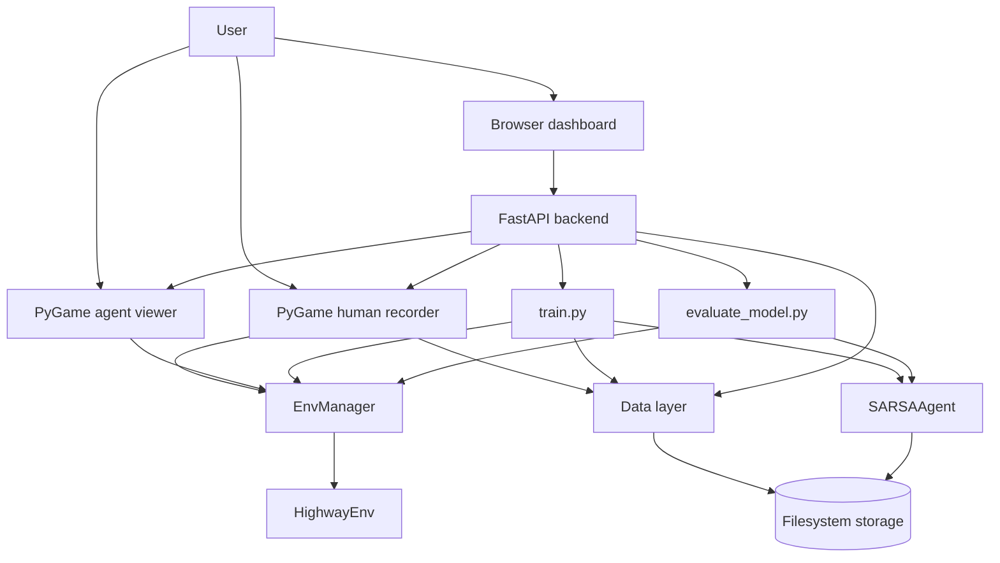
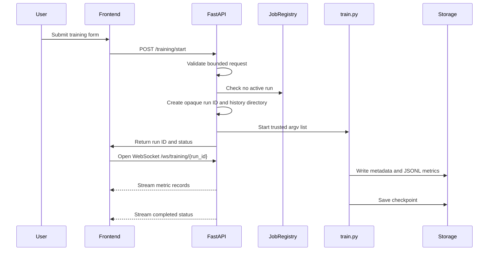
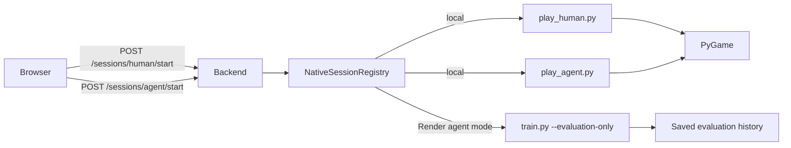
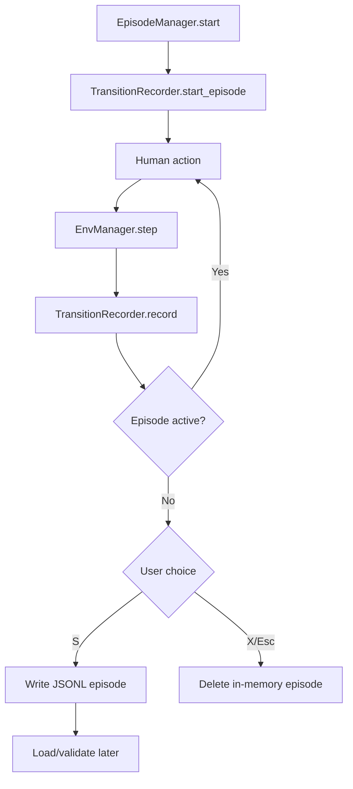
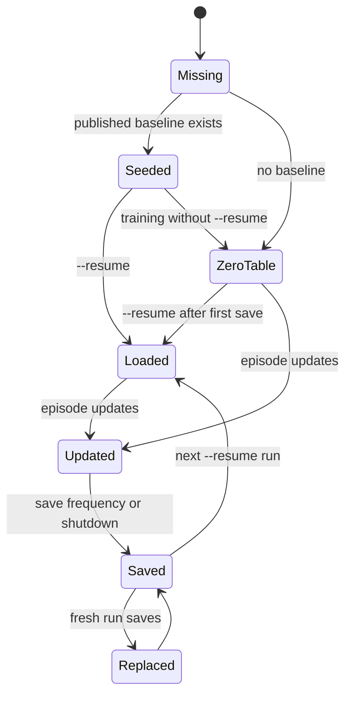
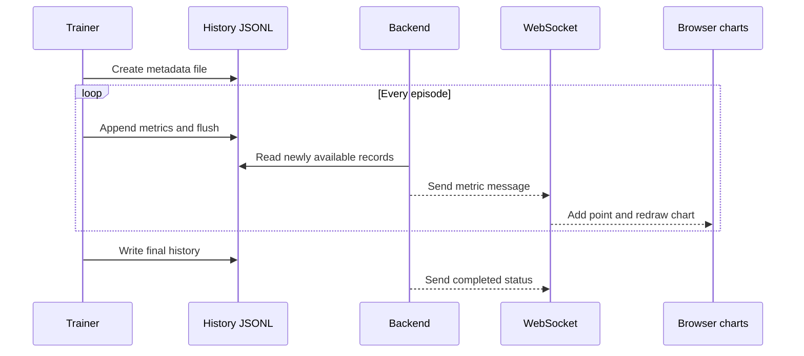

# Architecture

## 1. Architectural summary

Arena Self-Driving is a local-first application with a browser control surface,
native PyGame presentation windows, a FastAPI process coordinator, and a
filesystem-based persistence layer.

There is no relational database, ORM, SQL schema, or external message broker.
Persistent application data is stored as:

- JSONL human demonstrations
- NumPy SARSA checkpoints
- JSONL training histories
- JSON metadata files
- Markdown evaluation reports

The architecture separates simulation, learning, data, presentation, and
process-control responsibilities so the same SARSA logic can run from the
command line, browser, native viewer, or hosted headless service.



## 2. Design goals

The system is designed around these goals:

1. Keep the learning algorithm transparent and inspectable.
2. Keep simulation access behind one environment facade.
3. Keep recorded data validated and human-readable.
4. Allow local native windows without embedding desktop UI in the browser.
5. Make training runs observable through saved metrics and WebSockets.
6. Keep hosted execution headless and local human driving unavailable there.
7. Avoid accepting arbitrary client paths or shell command strings.

## 3. Repository layers

```text
arena-self-driving/
|
|-- backend/       FastAPI API and subprocess orchestration
|-- frontend/      No-build browser dashboard
|-- src/
|   |-- agents/    SARSA policy and checkpoint operations
|   |-- data/      Schemas, validation, loading, recording, summaries
|   |-- envs/      HighwayEnv factory, actions, state conversion
|   |-- human/     Keyboard mapping and human episode lifecycle
|   |-- simulation/Environment lifecycle facade
|   |-- training/  Warm-start, training, evaluation orchestration
|   `-- storage.py  Storage-root and directory policy
|-- scripts/       User-facing command-line and PyGame entry points
|-- configs/       YAML environment and JSON keyboard configuration
|-- artifacts/     Local runtime checkpoint and run output
|-- data/          Local human demonstrations
|-- published/     Tracked baseline checkpoint and history
|-- docs/          Architecture and operational documentation
`-- tests/         Unit and integration tests
```

## 4. Layer responsibilities

| Layer | Main modules | Responsibility |
|---|---|---|
| Presentation | `frontend/`, `scripts/play_human.py`, `scripts/play_agent.py` | Browser and native PyGame interaction |
| API/control | `backend/main.py` | HTTP endpoints, WebSockets, child-process ownership |
| Training | `src/training/orchestrator.py`, `scripts/train.py` | Episode loops, warm-start, evaluation, checkpoint timing |
| Agent | `src/agents/sarsa.py` | Epsilon-greedy policy, Q updates, table persistence |
| Simulation | `src/simulation/env_manager.py` | Reset, step, state snapshots, reward and lifecycle |
| Environment | `src/envs/highway_factory.py`, `state_builder.py`, `actions.py` | HighwayEnv configuration and state/action contracts |
| Human input | `src/human/` | Keyboard translation and episode ownership |
| Data | `src/data/` | JSONL schema, recorder, validation, loading, summaries |
| Storage | `src/storage.py` | Storage root, directory creation, baseline seeding |
| Configuration | `configs/` | Environment bins, rewards, timing, control profiles |

Dependencies flow inward toward domain behavior:

```text
frontend / PyGame
        |
        v
backend or scripts
        |
        v
training / human lifecycle
        |
        v
simulation facade
        |
        +--> agent
        +--> data
        `--> environment factory
```

The environment factory is the only module that directly knows how to create a
Gymnasium/HighwayEnv environment. Presentation code should use `EnvManager`
instead of constructing Gym environments itself.

## 5. Runtime entry points

### 5.1 Browser workbench

```powershell
python -m backend.main
```

`backend.main`:

- Creates the FastAPI application
- Ensures required storage directories exist
- Serves `frontend/index.html`, CSS, and JavaScript
- Validates browser training requests with Pydantic
- Starts trusted child processes for training and native sessions
- Tracks active jobs in memory
- Reads saved metrics for the browser
- Streams run updates over WebSockets
- Serves documentation files

The browser is a control surface, not the training implementation. Training is
performed by a child process running `scripts/train.py`.

### 5.2 Human recorder

```powershell
python scripts/play_human.py
```

The recorder:

1. Opens a PyGame setup screen.
2. Creates an `EpisodeManager`.
3. Starts `EnvManager` with `rgb_array` rendering.
4. Translates held arrow keys into the five action values.
5. Steps the environment at the decision frequency.
6. Records each transition.
7. Saves or discards the complete episode after termination.

### 5.3 Agent viewer

```powershell
python scripts/play_agent.py
```

The viewer:

1. Loads the runtime Q-table if it exists.
2. Starts a rendered environment.
3. Selects actions automatically.
4. Displays the current action, speed, target speed, road mode, reward, and
   duration.
5. Allows pause, target speed, duration, road mode, and HUD controls.

With `--train --save`, it can update and save the table interactively. Normal
playback is evaluation-style and does not learn.

## 6. Browser request flow



The backend does not interpolate a client-provided command string into a shell.
It builds a fixed executable argument list and uses `shell=False`.

## 7. Native session flow



Only one process per native session type is allowed at a time. If a human or
agent window is already open, the API returns a conflict instead of opening a
duplicate session.

On Render:

- Human sessions return a clear unsupported response because keyboard windows
  are local-only.
- Agent playback becomes one headless evaluation run.
- Evaluation metrics are saved and shown in the browser.

## 8. Environment and simulation layer

### 8.1 Environment factory

`src/envs/highway_factory.py` loads `configs/default_env.yaml`, merges runtime
overrides, translates the YAML structure into HighwayEnv's flat configuration,
and creates `highway-v0`.

It owns:

- Lane count
- Vehicle count and density
- Observation type
- Action type
- Reward settings
- Simulation and policy frequencies
- Rendering dimensions

It does not own the SARSA algorithm, browser behavior, or file persistence.

### 8.2 Environment manager

`EnvManager` is the simulation facade shared by training, playback, and human
recording.

```mermaid
flowchart TD
    Client[Training or viewer client]
    Reset[EnvManager.reset(seed)]
    Step[EnvManager.step(action)]
    Gym[HighwayEnv]
    Snapshot[StepResult]
    State[Raw and discrete state]
    Metrics[Reward, lane, speed, step count]

    Client --> Reset
    Reset --> Gym
    Gym --> Snapshot
    Client --> Step
    Step --> Gym
    Gym --> Snapshot
    Snapshot --> State
    Snapshot --> Metrics
```

`StepResult` carries:

- Raw observation
- Flattened raw state
- Discrete state index
- Reward
- Terminated/truncated flags
- Environment info
- Action taken
- Lane index
- Ego speed

This gives every consumer the same lifecycle and state contract.

## 9. Agent and training layer

`SARSAAgent` owns the policy and table. `TrainingOrchestrator` owns episode
control.

```mermaid
flowchart TD
    Start[Start episode] --> Reset[Reset EnvManager]
    Reset --> State[Build discrete state]
    State --> Choose[Agent chooses action]
    Choose --> Step[EnvManager.step]
    Step --> Transition[Build Transition]
    Transition --> Done{Episode done?}
    Done -->|No| Next[Choose next action]
    Next --> Update[SARSA Q update]
    Update --> Step
    Done -->|Yes| TerminalUpdate[Update with Q(next)=0]
    TerminalUpdate --> Metrics[Return episode metrics]
    Metrics --> Save[Write history and checkpoint]
```

The orchestrator:

- Enables training or evaluation mode
- Applies episode seeds
- Enforces maximum steps
- Selects the next on-policy action
- Calls `SARSAAgent.update`
- Aggregates TD error and Q metrics
- Calls optional live callbacks
- Returns a serialisable episode summary

The trainer script controls run-level concerns:

- Command-line parsing
- Random seeding
- Loading checkpoints
- Warm-starting demonstrations
- Creating history and metadata paths
- Periodic checkpoint saves
- Final cleanup

## 10. Data layer

The data layer is deliberately file-oriented. It provides schemas and
validation rather than a database server.

### 10.1 Transition schema

`src/data/schemas.py` defines `Transition`, the atomic training record:

```text
step
state
action
reward
next_state
terminated
truncated
discrete_state
next_discrete_state
lane
speed
timestamp
```

The raw continuous state is retained for inspection and compatibility. The
integer discrete state is what indexes the Q-table.

### 10.2 Episode metadata

Each saved JSONL episode begins with an `_type: "episode_metadata"` line:

```text
episode_id
vehicle
source
num_transitions
total_reward
start_time
end_time
seed
config_overrides
```

The remaining lines are transition records.

### 10.3 Recorder flow



The recorder does not update the Q-table. Demonstrations become learning input
only when `train.py --warm-start` is used.

### 10.4 Validation and loading

`src/data/validator.py` checks required fields and transition consistency.
`src/data/loader.py`:

- Loads one file or a directory
- Validates files before returning them
- Can skip invalid files
- Reconstructs typed metadata and transitions
- Provides flattened transition and summary helpers

The training orchestrator filters loaded episodes to vehicle label `S`, because
this project has one supported policy.

## 11. Persistence and “database” layer

### 11.1 Storage root

`src/storage.py` resolves the writable root:

```python
root = Path(os.environ["ARENA_STORAGE_DIR"]) if configured else PROJECT_ROOT
```

The default local root is the repository:

```text
D:\RAY\Projects\arena-self-driving
```

The storage layout is:

```text
<storage-root>/
|-- data/
|   `-- human_demonstrations/*.jsonl
|-- artifacts/
|   |-- checkpoints/sarsa_q_table.npy
|   |-- runs/<browser-run-id>/
|   |   |-- training_history_<run>.jsonl
|   |   `-- training_history_<run>.meta.json
|   `-- training_history_<run>.jsonl
|-- published/
`-- accuracy.md
```

The `published/` directory is repository-managed baseline data and is copied
into a fresh writable storage root only when the target checkpoint/history does
not already exist.

### 11.2 Why there is no SQL database

This application is a local educational workbench. File persistence is enough
for its workload:

- Episodes are appendable line-oriented records.
- Q-tables are naturally stored as NumPy arrays.
- Run metadata is small JSON.
- Evaluation history is human-readable Markdown.

This design avoids database setup and keeps experiments portable. It also means
there are no transactions, indexes, migrations, joins, or concurrent database
queries. File writes and process ownership provide the required consistency
for the current single-user workflow.

If the system later needs multi-user concurrent training, searchable
large-scale histories, or transactional coordination, a database and job queue
would become reasonable extensions.

### 11.3 Checkpoint lifecycle



Without `--resume`, the old runtime table is not loaded. The new zero table
replaces the runtime checkpoint when it is saved. Demonstration files,
historical JSONL runs, and published files are separate and are not deleted.

## 12. Frontend architecture

The frontend is plain HTML, CSS, and JavaScript:

```text
frontend/index.html
        |
        +-- styles.css
        `-- app.js
```

The JavaScript:

- Submits validated form values to `/training/start`
- Opens a WebSocket for live metrics
- Falls back to polling when WebSockets are unavailable
- Draws reward, steps, epsilon, and TD-error charts on canvas
- Starts local human/agent sessions
- Loads saved run histories
- Loads Markdown documentation from backend endpoints

The frontend does not own model state. It displays state held by the backend,
training process, and filesystem.

## 13. Backend API responsibilities

Important endpoints include:

| Endpoint | Responsibility |
|---|---|
| `POST /training/start` | Validate and launch one training run |
| `GET /training/status/{run_id}` | Return in-memory process status |
| `POST /training/stop/{run_id}` | Stop the active training process |
| `GET /runs` | List saved run metadata |
| `GET /runs/{run_id}/metrics` | Read one run's JSONL metrics |
| `WS /ws/training/{run_id}` | Stream new metrics and status |
| `POST /sessions/human/start` | Launch local human recorder |
| `POST /sessions/agent/start` | Launch local agent viewer/evaluation |
| `GET /demonstrations/summary` | Return validated demonstration totals |
| `GET /docs/{name}` | Return an allowlisted project document |

The job registry is intentionally in-memory. Saved histories remain the durable
source of run evidence if the backend process restarts.

## 14. Run and metrics flow



Metrics are append-only per run. This makes partial progress visible and gives
the project a durable experiment record independent of the in-memory registry.

## 15. Hosted deployment

On Render, the service uses:

```text
uvicorn backend.main:app --host 0.0.0.0 --port $PORT
```

Differences from local mode:

- The service binds to the Render-provided port.
- Storage uses the configured Render storage path.
- Human PyGame keyboard sessions are unavailable.
- Agent playback is replaced by headless evaluation.
- Training and evaluation still write run histories and checkpoints.

The hosted service should not be treated as a desktop display server.

## 16. Security and process boundaries

The backend applies several boundaries:

- Request models reject unknown training fields.
- Numeric values have explicit minimum and maximum limits.
- The server builds a fixed script argument list.
- Child processes use `shell=False`.
- Client requests cannot provide arbitrary executable paths.
- Documentation names are resolved from an allowlist.
- Run identifiers are generated by the backend.
- Run history paths are derived from server-owned directories.
- Only one browser training job is active at a time.
- Native session registries prevent duplicate windows.

The local server binds to `127.0.0.1`. Render binds externally because the
platform requires it and places the service behind its deployment boundary.

## 17. Failure and recovery behavior

| Failure | Behavior |
|---|---|
| Missing checkpoint with `--resume` | Trainer exits with a clear error |
| Invalid Q-table shape | Load raises `ValueError` |
| Invalid demonstration | Loader skips or raises according to configuration |
| Training already active | Backend returns HTTP 409 |
| Native window already open | Backend returns HTTP 409 |
| WebSocket unavailable | Frontend polls saved status and metrics |
| Child process cannot start | Backend returns HTTP 500 |
| Human session on Render | Backend returns HTTP 501 |
| Port 8000 already occupied | Existing process must be stopped or another port used |

## 18. Extension points

Potential extensions can be added at clear boundaries:

- Add another agent implementation behind the agent interface.
- Add a new state feature and update the state-bin contract.
- Add another presentation surface using `EnvManager`.
- Add a database repository behind the data/storage interfaces.
- Add a queue and persistent job registry for multi-user hosting.
- Add model version directories instead of one runtime checkpoint.

Any state-space or action-space change must also update checkpoint compatibility,
tests, documentation, and evaluation comparisons.

## 19. Useful source map

| File | Role |
|---|---|
| `backend/main.py` | FastAPI routes and process registries |
| `frontend/index.html` | Dashboard structure |
| `frontend/app.js` | Browser API, WebSocket, charts, docs |
| `src/storage.py` | Storage-root and baseline initialization |
| `src/envs/highway_factory.py` | HighwayEnv creation |
| `src/simulation/env_manager.py` | Reset/step facade |
| `src/envs/state_builder.py` | Raw-to-discrete state conversion |
| `src/envs/actions.py` | Action enum and validation |
| `src/agents/sarsa.py` | Q-table policy and persistence |
| `src/training/orchestrator.py` | Training/evaluation loops |
| `src/human/episode_manager.py` | Human episode lifecycle |
| `src/data/recorder.py` | JSONL recording |
| `src/data/loader.py` | Validation-aware loading |
| `scripts/train.py` | Headless training entry point |
| `scripts/play_human.py` | Native human recorder |
| `scripts/play_agent.py` | Native agent viewer |

## 20. Validation commands

```powershell
python -m pytest
python -m compileall -q backend scripts src tests
```

These validate the implementation and do not train or replace the model.
