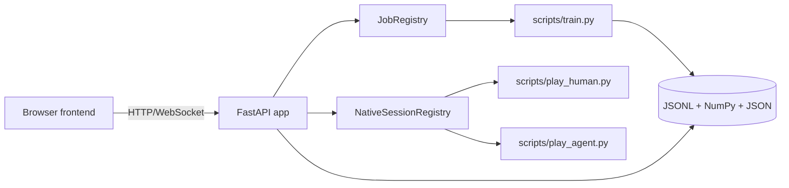
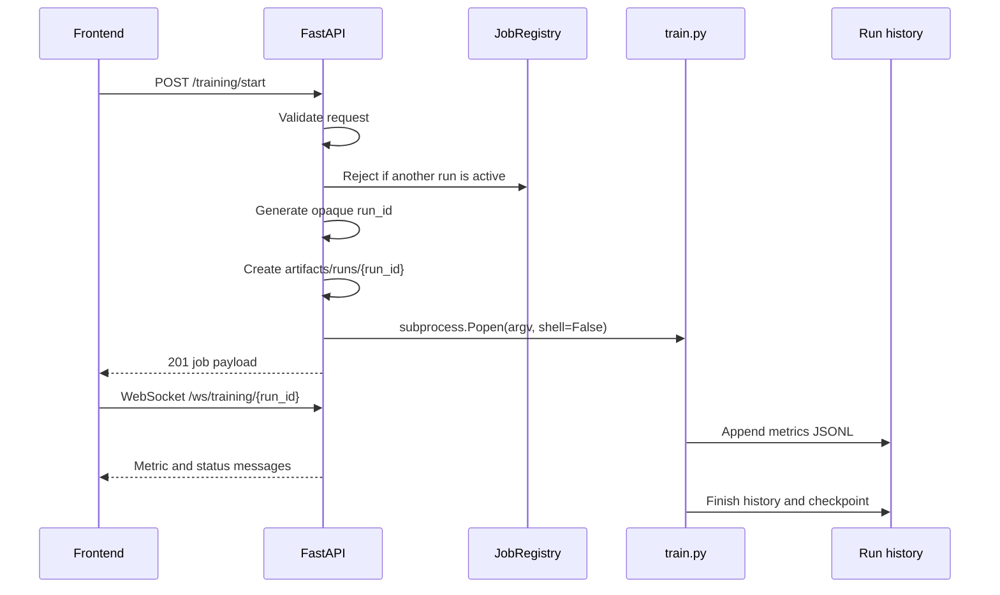

# Backend Notes

## Purpose

`backend/main.py` is a small FastAPI control plane. It does not implement
HighwayEnv or SARSA itself. Its job is to validate browser requests, create
server-owned run directories, launch trusted worker processes, expose saved
results, and stream progress to the dashboard.



## Startup and storage

Start locally from the repository root:

```powershell
python -m backend.main
```

The application:

1. Resolves `PROJECT_ROOT`.
2. Resolves the writable root through `ARENA_STORAGE_DIR`.
3. Calls `ensure_storage_dirs()`.
4. Creates the FastAPI application.
5. Mounts the static frontend.
6. Registers API, WebSocket, and documentation routes.

Local default address: `http://127.0.0.1:8000`.

The backend creates:

```text
<storage-root>/
|-- data/human_demonstrations/
|-- artifacts/checkpoints/
`-- artifacts/runs/
```

If the writable checkpoint or published history is absent, the storage helper
can seed it from the tracked `published/` directory. Existing runtime files are
not overwritten.

## Request validation

`TrainingRequest` is the browser-to-worker contract. It:

- Allows only the supported agent type `S`.
- Rejects unknown fields with Pydantic `extra="forbid"`.
- Bounds episodes, learning parameters, traffic, duration, and seed.
- Requires `epsilon_end <= epsilon_start`.
- Accepts explicit `resume` and `warm_start` flags.

The backend converts the validated model to a fixed `list[str]`. It never
accepts a shell command, executable path, checkpoint path, or history path from
the browser.

## Training lifecycle



The worker inherits the project working directory and receives explicit paths
for history, checkpoint, and demonstration storage. Local worker output is
suppressed to avoid duplicating logs in the browser process; hosted worker
output remains available to the platform.

## JobRegistry

`JobRegistry` is an in-memory, thread-safe map of run IDs to:

```text
run_id
pid
status
created_at
history_dir
stopped_at
```

It owns only process state. The durable evidence is the history and metadata
written to disk. On status lookup, it reconciles an exited child process to
`completed` or `failed`. A requested termination becomes `stopped`.

A FastAPI restart clears the registry but does not delete saved runs. The
frontend can still list and load completed histories.

## NativeSessionRegistry

Local human and agent sessions are launched as separate PyGame processes:

```text
POST /sessions/human/start -> scripts/play_human.py
POST /sessions/agent/start -> scripts/play_agent.py
```

The registry prevents two windows of the same mode from being opened at once.
On Render, human mode returns HTTP 501. Agent mode starts one headless
`train.py --evaluation-only --resume` run and stores it as a normal history.

## API contract

| Route | Behavior |
|---|---|
| `POST /training/start` | Validate and start one training worker |
| `GET /training/status/{run_id}` | Return server-owned job status |
| `POST /training/stop/{run_id}` | Terminate that run if active |
| `GET /runs` | List saved run metadata |
| `GET /runs/{run_id}/metrics` | Read one run's JSONL metrics |
| `WS /ws/training/{run_id}` | Stream metrics and terminal status |
| `POST /sessions/human/start` | Start local human recorder |
| `POST /sessions/agent/start` | Start local viewer or hosted evaluation |
| `GET /demonstrations/summary` | Return validated demonstration totals |
| `GET /documentation` | Return the allowlisted document list |
| `GET /documentation/{document_id}` | Return one allowlisted Markdown file |

Metrics are read defensively while a worker is flushing its final line. A
partial invalid JSONL line is skipped during live reads and becomes visible to
the validator if it remains invalid.

## WebSocket behavior

The WebSocket identifies a run by the server-generated ID. It watches the
corresponding history and sends:

```json
{"type": "metric", "data": {...}}
{"type": "status", "data": {"status": "completed"}}
```

If the browser cannot maintain the socket, `app.js` falls back to HTTP polling.
The saved history therefore remains the source of truth.

## Documentation route safety

Documentation IDs are looked up in the `DOCUMENTS` dictionary. The client sends
an ID such as `architecture` rather than a filesystem path. Unknown IDs return
HTTP 404, preventing arbitrary file reads through the documentation endpoint.

## Hosted operation

For a hosted process, use:

```powershell
uvicorn backend.main:app --host 0.0.0.0 --port $PORT
```

The browser and headless training/evaluation work, but PyGame keyboard windows
do not. Hosted files may be ephemeral; publishing a checkpoint remains an
explicit local/Git workflow and is not performed by the API.

## Operational limits

- One browser training job at a time.
- One local human window and one local agent window at a time.
- Run status is process-memory state.
- Run history is filesystem state.
- There is no authentication or multi-user authorization.
- There is no queue: a second training request receives HTTP 409.

## Troubleshooting

If port 8000 is occupied, either reuse the existing server or identify and stop
the specific listener before restarting. Do not start multiple backend copies
expecting them to share the in-memory registry.

If a job disappears after a backend restart, inspect `artifacts/runs/`; the
history and metadata are still the durable record.
