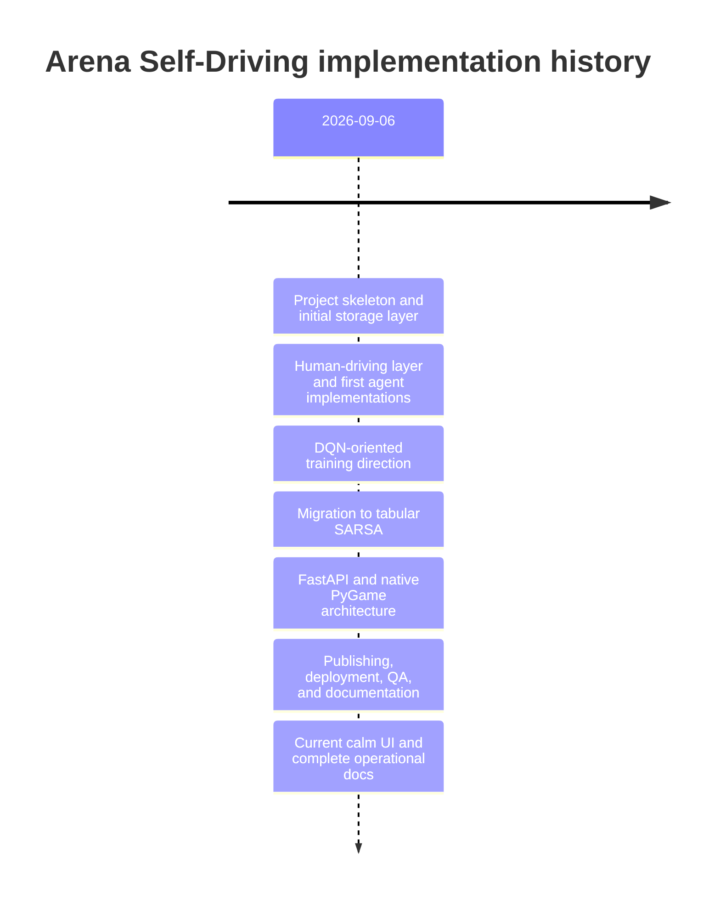
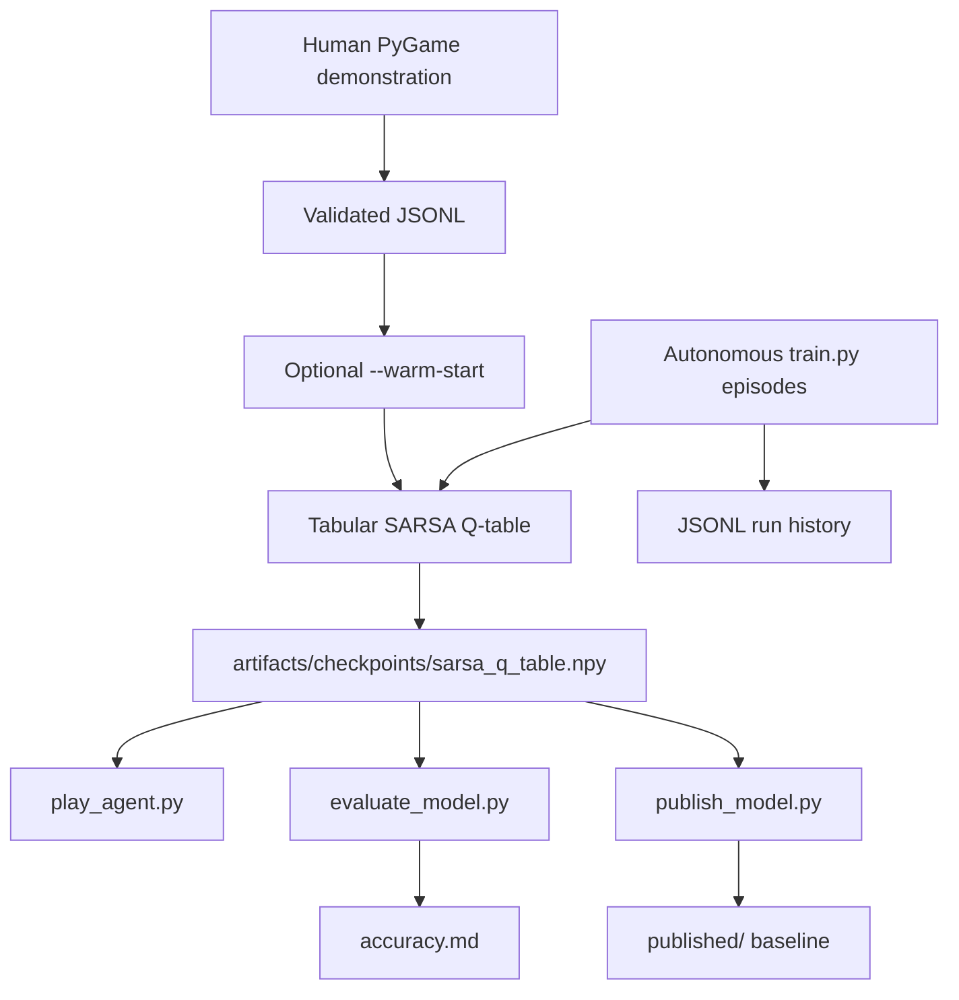

# Project Timeline and Evolution

This timeline follows the repository's Git commit order. All recorded commits
currently have the same calendar date in the local history
(`2026-09-06`). Commits named **Agent host session** are grouped with the
feature they helped refine.



## 1. Foundation: project skeleton and persistence

### `66137a5` — project skeleton & setup

The repository began with the basic application structure, dependency setup,
configuration files, source packages, scripts, and tests. This established the
separation that remains today:

```text
configs/
src/
scripts/
tests/
frontend/
backend/
docs/
```

### `d1b1095` — Database Layer

The original project plan called the persistence work a “database layer”.
The implemented design became a local filesystem data layer rather than SQL:

- JSONL demonstrations and histories
- NumPy model/checkpoint files
- JSON metadata
- Markdown performance reports
- Configured storage roots

This is important historical context: the project has a database-layer
responsibility, but it does not currently run PostgreSQL, SQLite, an ORM, or a
database server.

### `26233fe` — Prompting techniques

This phase added project guidance and operating context around the learning
workflow. The documentation later became more implementation-specific as the
runtime design stabilized.

### `0956b0e` — Added Documentation

The initial documentation set was added and then repeatedly expanded as the
actual scripts, storage rules, UI, and deployment behavior became clearer.

## 2. Human control and the first learning direction

### `830e153` — human layer built

The human-driving layer established the idea that a person could control the
ego vehicle and produce training evidence. The current version of that idea is
the native PyGame recorder:

```text
Arrow keys -> action mapping -> EnvManager.step()
           -> TransitionRecorder -> validated JSONL demonstration
```

Saved demonstrations are now optional warm-start data for the SARSA table;
they are not silently used unless `--warm-start` is requested.

### `eeceae0` — Agents sarsa & dqn

The project temporarily contained both SARSA and DQN agent directions. This is
the historical point at which the project was exploring a neural deep
reinforcement-learning approach alongside a tabular approach.

The early DQN direction used the kinds of components normally associated with
deep Q-learning:

- A neural policy/value model
- Replay-buffer-style training controls
- Target-network-related configuration
- Device and PyTorch checkpoint concerns
- More complex model artifacts

The early history also contains DQN-oriented controls such as learning-rate,
gamma, device, target-update frequency, and buffer-capacity options. Those
controls belonged to the earlier implementation and should not be confused
with the current SARSA command contract.

## 3. Training orchestration and initial dashboard

### `c13fa65` — Training Orchestrator

Training was separated from the agent implementation. This introduced the
episode-level workflow that still exists conceptually:

1. Reset the environment.
2. Convert observations into a policy state.
3. Select an action.
4. Step the environment.
5. Update the learning algorithm.
6. Record metrics.
7. Save checkpoints and history.

The current orchestrator applies this workflow to on-policy tabular SARSA and
also supports demonstration warm-start and read-only evaluation.

### `26eec4c` — Assets created

Runtime assets and presentation resources were added for the simulation and
dashboard experience.

### `bd498a0` — UI design, typography, color palette

The first deliberate visual system was introduced. Later iterations replaced
the initial heavy/dark visual direction with the current warm-neutral,
muted-teal workbench.

### `9cbe8b9` — Streamlit Frontend built

The project initially used Streamlit as its primary browser dashboard. It
provided a quick way to expose controls and training results while the core
learning pipeline was still changing.

### `30d4b14` — Documentation improved

The first dashboard-era documentation was expanded to explain runtime scripts
and training controls.

### `0ea90a6` — documentation screenshots

Screenshots were added as visual evidence for the earlier dashboard and
simulation experience.

### `e2da947` and `3d6b9ce` — QA passes

These commits represent early verification and cleanup passes before the
architecture was simplified further.

## 4. Native simulation and removal of browser simulation

### `2f95fb8` — dark mode and car SVG fixes

Presentation issues in the earlier UI were corrected, including theme and
vehicle rendering problems.

### `963cb26` — added human native play

Human driving moved toward a native PyGame window. This was a key architectural
decision: desktop keyboard control and simulation rendering belong in a native
window, while the browser should coordinate sessions and show evidence.

### `8a5bd1f`, `b40c118`, `fc36749` — native play fixes

The native human and agent viewers were iterated to correct launch behavior,
controls, and runtime errors.

### `fe41b48` — visualization fixes

Rendering and visual feedback were refined as the native approach became the
primary interactive simulation surface.

### `efb0126` — removed web simulations to native

The project stopped trying to reproduce the complete driving simulation inside
the browser. The resulting split is still the current one:

```text
Browser: control, training forms, charts, documentation
PyGame: keyboard driving, native playback, simulation rendering
```

### `2fbfd5b` — optimization and refactor

Shared responsibilities were cleaned up so the environment, agent, data, and
presentation layers could evolve independently.

### `ca9c422` — improved documentation and training controls

Training flags, run behavior, and operational guidance became more explicit.

## 5. DQN-era hardening before the algorithm decision

The following history records work done while the earlier DQN-capable design
was still present:

- `063735f`: persisted episode history, reloaded history in the dashboard,
  fixed DQN loading behavior, and ignored generated artifacts in Git.
- `88b440e`: exposed additional training controls including learning rate,
  gamma, device, target-update frequency, buffer capacity, and per-run history.
- `6c91d93`: added greedy evaluation, per-run metadata, and artifact browsing.
- `c43eeea`: improved multi-agent observation handling.
- `f513db1`: supported one-dimensional ego observations and environment-based
  state reconstruction.
- `7f248f2`: documented command-line scripts and flags.

These commits are retained in history because they explain why some old
documentation or artifacts mention DQN, replay buffers, or target updates.
Those concepts are historical, not part of the current supported model.

## 6. The algorithm change: DQN to tabular SARSA

### `ef5fa72` — changed to SARSA and fixed cloud Python support

This is the decisive algorithm migration. The project moved from the more
complex DQN direction to one transparent tabular SARSA policy.

### Why the project changed

The current project is educational and needs behavior that can be inspected,
explained, and reproduced without requiring a neural-network training stack.
The selected environment state can be discretised into a small finite space:

```text
4 lanes
× 3 ego-speed bins
× 3 front-gap bins
× 3 front-speed-difference bins
× 2 left-lane safety values
× 2 right-lane safety values
× 2 rear-gap bins
= 864 states
```

With five discrete actions, the complete model is:

```text
Q-table shape = (864, 5)
```

### What the current algorithm does

SARSA is on-policy temporal-difference learning. For each transition:

```text
Q(s, a) <- Q(s, a) +
           alpha * (r + gamma * Q(s', a') - Q(s, a))
```

The important difference from the earlier DQN direction is that the current
agent:

- Stores one numeric table rather than neural weights.
- Does not need a replay buffer.
- Does not need a target network.
- Does not need PyTorch or GPU training.
- Selects the next action using the same policy during training.
- Can be inspected by printing one state row and its five action values.
- Saves directly to `sarsa_q_table.npy`.

For terminal transitions, the next-state value is zero:

```text
target = reward
```

### `8a7a1b3` — final review and stale DQN cleanup

The final review explicitly cleaned stale DQN references, corrected tests,
updated the timeline, and exported state-reconstruction support. This commit
marks the point where the repository documentation and implementation were
being aligned around SARSA rather than presenting two competing algorithms.

## 7. State and environment robustness

### `443cb22` — fixed state builder

State conversion was corrected and made more reliable for HighwayEnv
observations.

### `d2de5ee` — changed Streamlit to FastAPI start

The browser control plane began moving from the Streamlit dashboard to a
FastAPI service with a static frontend.

### `8ff1cd4` — warn on state reconstruction zero-padding

The state layer became explicit when neighbour rows were unavailable and had
to be reconstructed or zero-padded. This protects users from assuming that
missing traffic information is real observed traffic.

## 8. FastAPI, frontend, and deployment direction

### `7f2fef0` — FastAPI built with SARSA

The FastAPI control surface was connected to the current SARSA training
workflow.

### `11b9749` — native controls, analytics, and docs frontend

The browser gained:

- Native session buttons
- Training controls
- Live analytics
- Saved-run browsing
- Demonstration summaries
- Documentation navigation

### `ad914a9` — final documentation pass

The project documentation became a first-class product surface rather than only
a README.

### `068e1da` — finalised deployment

Hosted startup and headless behavior were refined. The current architecture
keeps human keyboard recording local and allows hosted headless training and
evaluation.

### `a823d76` and `7e924ae` — hosted runtime fixes

These commits addressed Python/PyGame compatibility and hosted WebSocket
training/evaluation behavior. The later project cleanup consolidated hosted
guidance into the general backend and commands documentation.

## 9. Model publishing and evidence

### `b0b09d7` — published model accuracy fixes

Publishing and evaluation were separated more clearly:

```text
evaluate_model.py -> accuracy.md
publish_model.py  -> published/checkpoints + published/history
git commit/push   -> explicit sharing
```

Evaluation does not train or overwrite the model. Publishing is explicit and
does not happen merely because a training run completed.

### `273d475` — clean project and validate runtime

Old generated artifacts, old DQN checkpoints, stale histories, and obsolete
screenshots were removed from the tracked runtime surface. This is why the
current repository should be understood as SARSA-first even though Git history
contains DQN files and terminology.

### `11d7976` — Publish SARSA

A SARSA checkpoint and associated performance evidence were published as the
tracked baseline used when a new storage root is initialized.

### `6757567` — requirements fixed

Runtime dependency declarations were aligned with the current Python and
PyGame-compatible setup.

## 10. Current product refinement

### `128bd39` — fixed agent/human play, training, publishing, and docs

This broad stabilization pass aligned the main user workflows:

- Human demonstration recording
- Agent playback
- Training and resume behavior
- Evaluation and publishing
- Command documentation
- Browser presentation

### `d33d930` — attribution

The README received the project attribution:

```text
Made with heart by Priyanshu
```

The subsequent agent-session checkpoint commits represent detailed iterations
on the same product: documentation expansion, viewer controls, flicker
reduction, traffic placement, target speed, duration controls, storage
semantics, and UI polish.

## 11. Current implementation state

The project now has one supported learning path:



### Current capabilities

- HighwayEnv simulation with five validated actions.
- Seven-feature discrete state representation and 864-state table.
- Tabular SARSA training, resume, fresh training, greedy evaluation, and
  checkpoint persistence.
- Human demonstrations saved as validated JSONL.
- Optional demonstration warm-start.
- Native PyGame human and agent windows.
- Orange controlled vehicle and calmer native HUD.
- Traffic placed ahead and behind the ego vehicle.
- Target speed separated from current simulation speed.
- Duration and road-mode controls.
- FastAPI browser control surface.
- WebSocket live metrics with polling fallback.
- Saved-run analytics and documentation browser.
- Explicit model evaluation and publishing workflow.
- Automated tests for agents, backend, data, environments, training, and
  viewer controls.

## 12. Current evidence locations

| Evidence | Current location |
|---|---|
| Human demonstrations | `data/human_demonstrations/*.jsonl` |
| Runtime SARSA table | `artifacts/checkpoints/sarsa_q_table.npy` |
| Browser run histories | `artifacts/runs/<browser-run-id>/` |
| Direct-script histories | `artifacts/training_history_*.jsonl` |
| Run metadata | Matching `.meta.json` files |
| Evaluation timeline | `accuracy.md` |
| Published baseline | `published/checkpoints/` and `published/history/` |
| Source history | Git commits and this document |

## 13. What is historical versus current?

| Topic | Historical approach | Current approach |
|---|---|---|
| Learning algorithm | DQN-capable neural direction | Tabular SARSA |
| Model artifact | PyTorch/DQN policy artifacts | `sarsa_q_table.npy` |
| Experience | Replay-buffer-oriented controls | On-policy transition updates |
| Targeting | Target-network controls | Direct SARSA next-action value |
| Browser simulation | Earlier web/dashboard simulation | Native PyGame simulation |
| Browser framework | Streamlit | FastAPI plus static HTML/CSS/JS |
| Persistence | “Database layer” concept | Filesystem JSONL/NumPy/JSON/Markdown |
| Hosted human driving | Considered through UI surfaces | Explicitly local-only |
| Model labels | Multiple early agent directions | One supported label: `S` |

## 14. Reproducibility and project handoff

To reproduce the current workflow:

```powershell
python -m pytest
python -m compileall -q backend scripts src tests
python scripts/train.py --episodes 100 --seed 1000
python scripts/evaluate_model.py --episodes 10 --steps 300 --seed 1000
```

To continue the existing model:

```powershell
python scripts/train.py --episodes 100 --resume --seed 2000
```

To intentionally start a separate experiment, set `ARENA_STORAGE_DIR` to a new
directory. Omitting `--resume` starts a zero-initialised table, but does not
delete demonstrations, old histories, published files, or source code.

## 15. Final interpretation

The repository did not arrive at SARSA by simply adding another model. It
evolved from a broader DQN-capable prototype toward a smaller, more reliable,
more teachable system:

```text
prototype exploration
    -> human interaction
    -> DQN/SARSA alternatives
    -> state and training hardening
    -> SARSA decision
    -> native simulation
    -> FastAPI workbench
    -> published, testable educational product
```

The current design intentionally favours transparency over neural-network
complexity. Every state, action, Q-value update, demonstration, checkpoint, and
evaluation record can be traced through source code and filesystem evidence.
