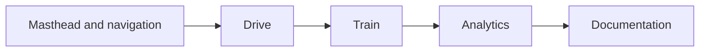

# UI Design System

## Current visual direction

The current interface is a calm, editorial control workbench rather than a
neon “AI dashboard”. It uses warm neutrals, muted teal actions, restrained
shadows, readable typography, and ordinary document scrolling. Motion is
limited to short hover/focus transitions; there are no heavy animated effects.



## Design tokens

The source of truth is `frontend/styles.css`:

| Token | Value | Use |
|---|---|---|
| `--bg` | `#f4f1eb` | Page background |
| `--surface` | `#fffdfa` | Main cards and panels |
| `--surface-soft` | `#f8f6f1` | Secondary cards and controls |
| `--surface-inset` | `#f1eee7` | Inset surfaces |
| `--border` | `#d9d4ca` | Normal boundaries |
| `--border-strong` | `#b9b1a4` | Form and emphasized boundaries |
| `--text` | `#242521` | Primary text |
| `--muted` | `#6c6b64` | Supporting text |
| `--accent` | `#315f59` | Teal primary action and links |
| `--accent-soft` | `#e0ebe6` | Selected and hover surfaces |
| `--danger` | `#9b493e` | Stop/destructive action |

Avoid adding neon cyan, saturated gradients, glow effects, or large decorative
animations. New colors should be added only when they communicate a distinct
state.

## Typography

The stack is:

```text
Body: Aptos, Segoe UI, Inter, system-ui
Headings and controls: Aptos Display, Aptos, Segoe UI, Inter, system-ui
Code: ui-monospace, Consolas, monospace
```

Headings use tight tracking and clear hierarchy. Body text uses a comfortable
line height. Labels are compact, muted, and semibold. Documentation uses the
same typography as the workbench so it reads as part of the product.

## Page structure

`frontend/index.html` presents four primary sections:

| Section | CTA | Purpose |
|---|---|---|
| Drive | Human drive / SARSA playback | Start native local sessions or hosted evaluation |
| Train | Start training | Configure and launch the SARSA worker |
| Analytics | Select saved run | Inspect live or historical metrics |
| Documentation | Select a document | Read project guidance in the workbench |

The masthead provides the project identity, local-session status, and anchor
navigation. Panels create a clear vertical rhythm and remain scrollable on
small screens.

## Interaction states

Every interactive control should have:

- A readable default state
- A visible hover state
- A visible `:focus-visible` ring or border change
- A disabled state when an operation is unavailable
- A danger treatment for stop/destructive actions

Current behavior includes:

- Teal buttons darken on hover.
- Secondary buttons gain a pale teal surface.
- Cards lift only with a small shadow and border change.
- Navigation links use a restrained underline transition.
- Saved runs and documentation tabs show selected/hover borders.
- Disabled buttons reduce opacity and remove the pointer affordance.

Do not use hover as the only way to reveal essential information. The target
speed, road mode, duration, current action, and run state are displayed as text.

## CTA hierarchy

Primary CTAs use filled teal buttons. Secondary actions use outlined or
transparent buttons. Stop uses the muted red danger style. Action cards include
a small arrow cue, but the arrow is supplemental and not the only label.

Button copy should describe the result:

```text
Start training
Human demonstration
SARSA playback
Stop training
Load saved run
```

## Charts and metrics

Charts are lightweight HTML canvas drawings in `frontend/app.js`; there is no
charting dependency. The main line uses `--accent`. Grid lines and labels use
neutral tones. Empty charts say `No recorded data` instead of showing a fake
zero.

Displayed training information includes:

- Total reward
- Episode number
- Steps
- Epsilon when available
- Saved-run history
- Demonstration count and total transitions

Charts are evidence displays, not decoration. Do not add animation that makes
live metrics flicker or obscures the latest value.

## Documentation presentation

The documentation panel:

- Lists allowlisted documents returned by `/documentation`.
- Loads one Markdown document at a time.
- Renders headings, lists, tables, links, inline code, and fenced code.
- Keeps long code and tables horizontally scrollable.
- Uses normal vertical page scrolling.
- Uses the same neutral surfaces and typography as the dashboard.

Mermaid diagrams are stored as fenced Markdown code for source portability.
The current lightweight renderer displays the source block rather than running
a client-side Mermaid runtime.

## Native PyGame UI

The browser controls sessions, while PyGame owns keyboard driving and rendered
simulation. Native windows use:

- Orange controlled vehicle
- Distinct NPC traffic
- Explicit target speed and current speed
- Road mode label
- Duration controls
- Pause and HUD controls
- Cached frames to avoid render flicker

The native UI should remain functional and information-dense without copying
the browser's panel layout.

## Accessibility and responsive behavior

- Use semantic buttons and labels.
- Preserve keyboard operation in forms.
- Keep focus-visible styles.
- Do not rely on color alone for status.
- Keep text readable at narrow widths.
- Collapse multi-column grids below the mobile breakpoint.
- Keep documentation tables and code horizontally scrollable rather than
  shrinking text to an unreadable size.

## Implementation checklist

Before changing the UI:

1. Reuse an existing token.
2. Preserve the warm neutral palette.
3. Add hover and focus behavior together.
4. Keep the interaction calm and short.
5. Ensure the state is also expressed in text.
6. Check mobile layout.
7. Open the local page and verify the changed interaction.
