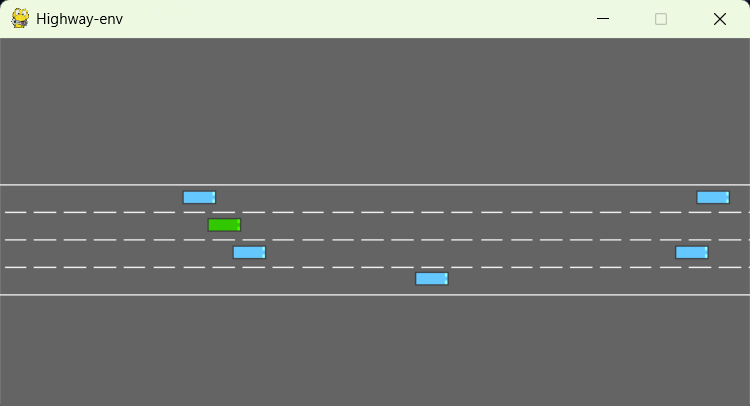
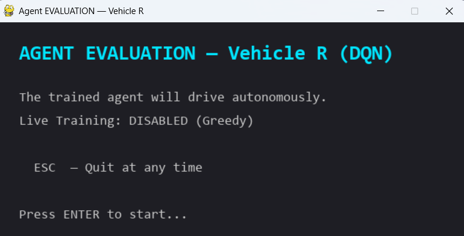
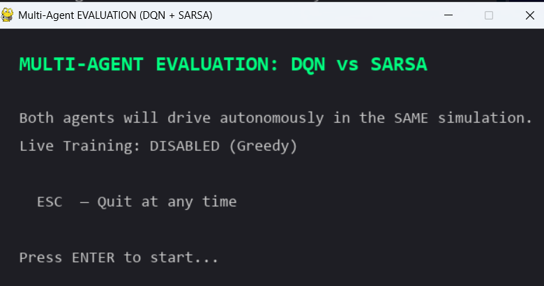

# Understanding Native Simulation Output

The interactive simulation is a native PyGame window backed by HighwayEnv.
Streamlit does not render or control this loop.

## Human driving

`python scripts/play_human.py R` opens an instruction screen first. Press
ENTER, then use the default Arrow profile to control the selected vehicle.
Press `C` on setup to switch to WASD; mappings live in
`configs/control_bindings.json`. The recorder shows the highway and traffic
directly in the native window. Its HUD reports the held input and last applied
action, `P` pauses without recording, and `+`/`-` adjust target speed. `/`
cycles City (12 m/s), Highway (18 m/s), and Express (24 m/s) pace presets.
Once an episode ends, press `S` to save or `X` to discard it; ESC discards an
unsafe or incomplete run. The HUD also exposes clickable Pause, -SPD, +SPD,
and pace-mode buttons.
NPC count and density are selected on setup because the environment creates
traffic when the episode begins.



This image should show the actual HighwayEnv window while a human controls the
vehicle.

## Agent playback

`python scripts/play_agent.py R` and `python scripts/play_agent.py S` open an
instruction screen that identifies the algorithm and whether the run is greedy
evaluation or exploratory training. The agent then acts every environment step
until the duration, collision, or window close ends the episode.

When launched with `--train`, single-agent playback exposes exploration in the
HUD. Use `Q`/`E` or the `-EPS`/`+EPS` buttons to lower/raise epsilon by 0.05;
the control has no effect in greedy evaluation mode.

`python scripts/play_multi_agent.py` runs DQN and SARSA together using two
controlled vehicles. This is the visual comparison mode; the Performance
Analytics page is the historical comparison mode.

The multi-agent window includes a live telemetry HUD with step progress,
current action, cumulative reward, lane, speed, crash/timeout state, and
training status for R and S. Its controls are:

`+`/`-` adjust target speed and `/` cycles City, Highway, and Express presets;
the HUD provides matching clickable controls.

- `SPACE` — pause or resume the episode
- `H` — hide or show the telemetry HUD
- `S` — save both checkpoints immediately
- `ESC` — stop the session



Optional side-by-side reference:



## Reading the result

- A collision ends the current episode and is reported in the terminal.
- A duration limit ends the episode without a collision.
- `--train` means the agent continues updating while it drives.
- `--save` writes the updated checkpoint after the native session.
- Both native modes keep the window open after a crash or timeout. Use the
  visible GUI controls to save, discard, restart where supported, or close.
- Before starting, the GUI adjusts NPC count, traffic density, target speed,
  and duration. In multi-agent mode, a crashed car stops taking decisions
  while the other continues until both crash or the duration limit is reached.
- If a checkpoint is missing, the viewer reports it and the agent may act
  randomly; this is expected for a new checkout.

The dashboard reads the resulting training history with:

```powershell
streamlit run app.py
```
