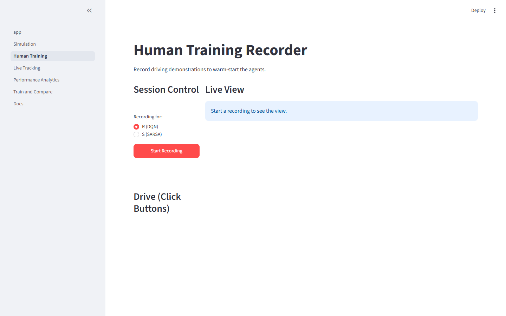
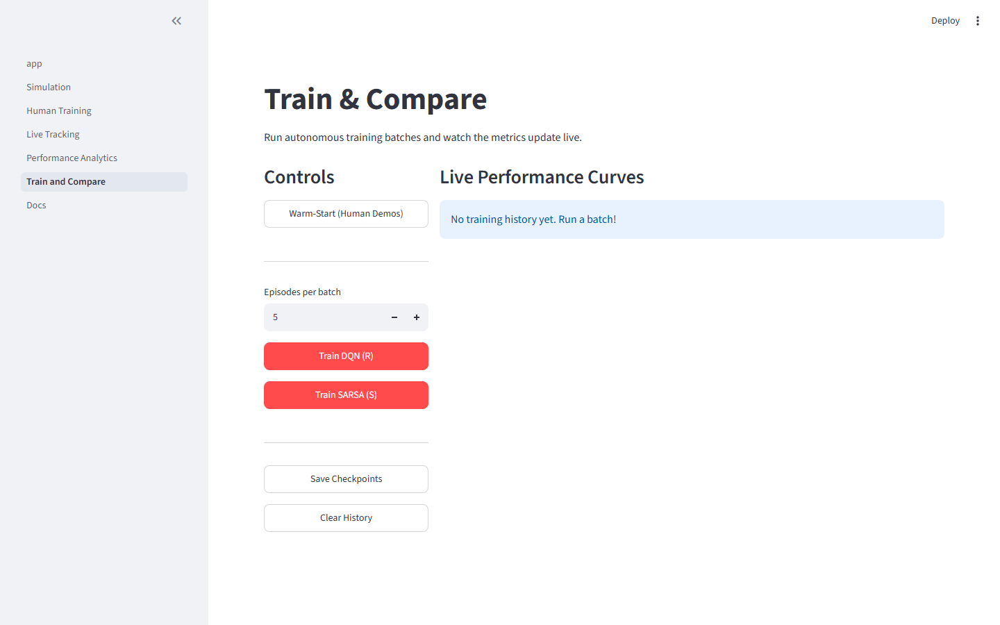

# End-to-End Training Guide

This walkthrough explains how to execute the entire 7-day training workflow using the Streamlit interface.

## 1. Record Human Demonstrations
Before the autonomous agents can learn efficiently, they need a safe baseline.

1. Open the UI and click **Human Training** in the sidebar.
2. Select **Agent: R (DQN)**.
3. Click **Start Recording**.
4. Use the on-screen buttons to control the car.
5. If the episode is safe, click **Save Episode**. If you crash, click **Discard Episode**.
6. Repeat until you have ~10-20 saved episodes.
7. Repeat the process for **Agent: S (SARSA)**.

## 2. Warm-Start the Agents
Once demonstrations are recorded, you must inject them into the agents.

1. Go to the **Train & Compare** page.
2. Click **Warm-Start (Human Demos)**.
3. You should see a success message indicating how many transitions were loaded into the DQN Replay Buffer and the SARSA Q-Table.

## 3. Run Autonomous Training
The agents are now ready to practice on their own.

1. On the **Train & Compare** page, select the number of **Episodes per batch** (e.g., 5).
2. Click **Train DQN (R)** or **Train SARSA (S)**.
3. The Live Performance Curves will update incrementally as the batch runs.
4. Watch the Reward and Survival Steps climb as the agents learn to avoid crashes.
5. **Important**: Click **Save Checkpoints** before closing the browser!

## 4. Evaluate Performance
To see the result of your training without any random exploration:

1. Go to the **Live Tracking** page.
2. Select the agent.
3. Click **Evaluate (Greedy)**.
4. The agent will drive using its fully optimized policy, rendering its actions live.

